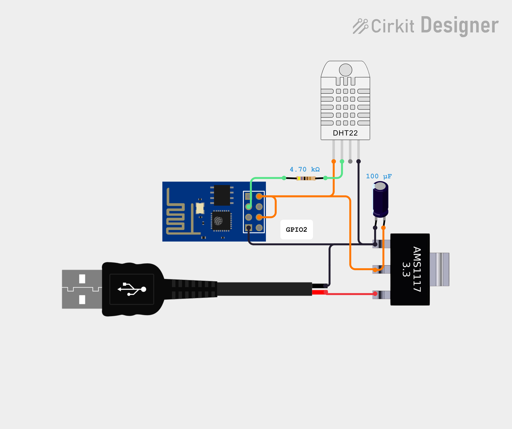

> [!IMPORTANT]  
> This project has been made for a specific purpose. If you want to replicate this, you would have to ADAPT IT. However, example code and circuit documentation are provided below on the index, and they are for general use. 

### Index
* [Circuit Explaination](docs/circuit.md)
* [Example code for general use](docs/example-code.md)

## Context
With the purpose of measuring the temperature of classrooms in our school (and so the thermal discomfort), I've made this project that connects esp-01 modules that act like mqtt clients that publishes temperature and humidity, and by the other side subscribes to a topic they use to know WHEN to send data. 

On the other hand, we'll need a broker, in this case I'll use a Raspberry Pi. This one has to send a request to their clients, receive temperature and humidity, then upload the data to a Google Spreadsheet. 

After a few months, this data will be used to analyse the thermal discomfort and then a request will be sent asking the authorities to allow the placement of rotating fans and curtains (currently there are few fans, they do not rotate and there are no curtains).
